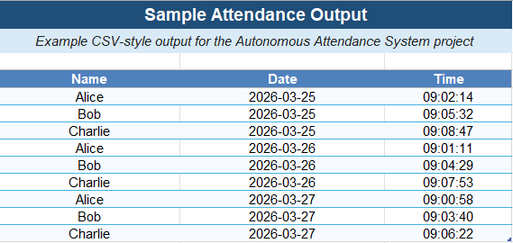

# Autonomous Attendance System

Computer vision project using **OpenCV** and **face recognition** to automate attendance marking from real-time webcam input.

## Project Overview

This project builds an attendance automation pipeline that:

- loads and encodes known face images
- performs real-time face recognition from webcam input
- overlays recognized names on screen
- logs attendance into a CSV file with date and time

## Technologies Used

- Python
- OpenCV
- face_recognition
- NumPy
- Pandas

## Expected Local Structure

```text
autonomous-attendance-system/
├── known_faces/
│   ├── Alice/
│   │   ├── alice1.jpg
│   │   └── alice2.jpg
│   └── Bob/
│       └── bob1.jpg
├── models/
├── outputs/
├── src/
│   ├── encode_faces.py
│   ├── attendance.py
│   └── utils.py
├── requirements.txt
└── README.md
```

## Installation
```text
pip install -r requirements.txt
```


## Encode Known Faces
```text
cd src
python encode_faces.py
```

## Run Attendance System
```text
cd src
python attendance.py
```

## Output
Attendance is saved to:
```text
outputs/attendance.csv
```


### Preview


