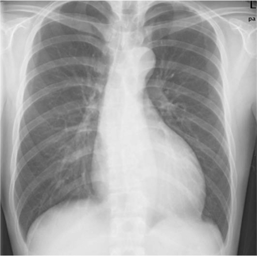

# Cardiomegaly Detection from Chest X-Rays

Deep learning project using **ResNet50 transfer learning** to detect cardiomegaly from chest X-ray images using the **NIH ChestX-ray14 dataset**.

## Project Overview

This project builds a computer vision pipeline for detecting **cardiomegaly (enlarged heart)** from chest X-ray images.

Key components include:

- Transfer learning with ResNet50
- Image preprocessing and augmentation
- Weighted sampling for class imbalance
- Model evaluation using accuracy, precision, recall, F1-score, and ROC-AUC

## Dataset

NIH ChestX-ray14 dataset.

The dataset contains **100,000+ chest X-ray images** with disease labels extracted from radiology reports.

Target class:
- Cardiomegaly

## Technologies Used

- Python
- PyTorch
- Torchvision
- Scikit-learn
- Pandas
- NumPy

## Project Structure
cardiomegaly-xray-classifier
│
├── src
│ ├── dataset.py
│ ├── model.py
│ ├── train.py
│ └── predict.py
│
├── requirements.txt
└── README.md

## Training

python src/train.py \
  --csv_path data/Data_Entry_2017.csv \
  --image_root data/images

## Inference

## Example

Input X-ray image:

Prediction:
{
"predicted_class": "Cardiomegaly",
"probability": 0.91
}
