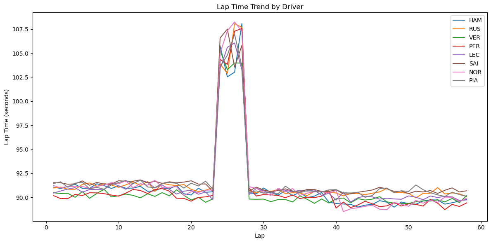
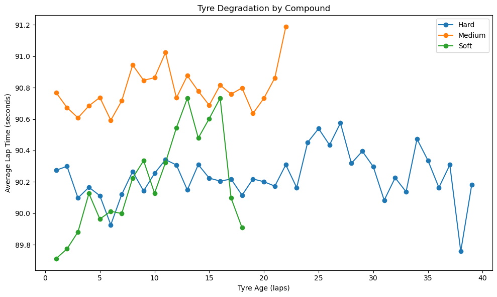
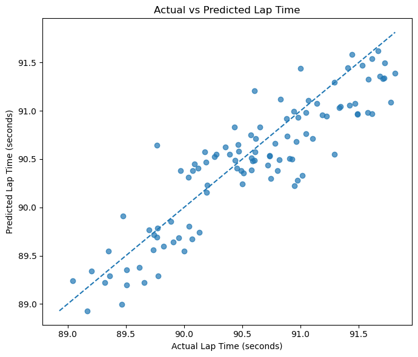
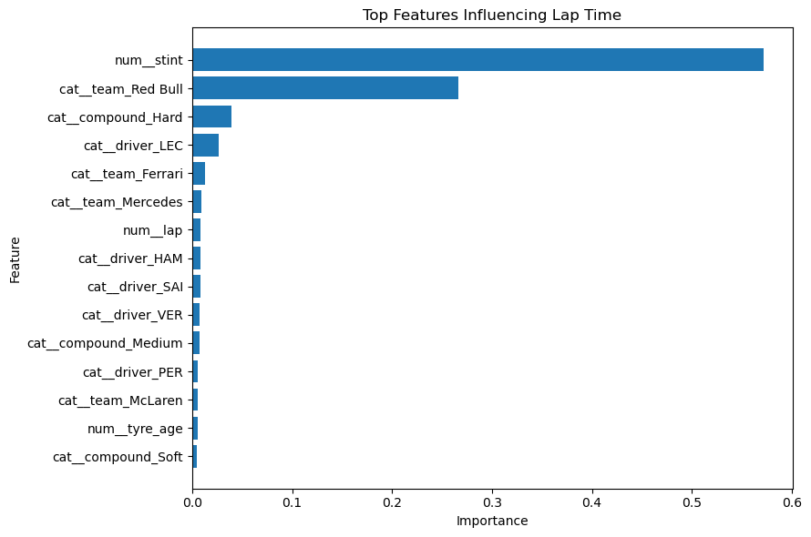
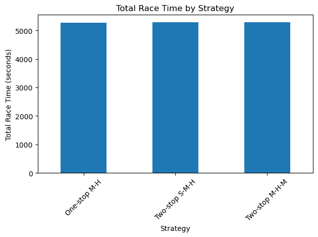
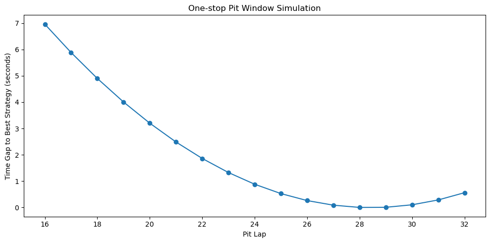

# Formula 1 Race Strategy Optimisation

## Project Overview

This project simulates Formula 1 race strategy decisions using synthetic lap-level race data, tyre compound behaviour, tyre degradation, pit stop timing and predictive analytics.

The aim is to build a Mercedes F1-style race strategy analytics project that compares one-stop and two-stop strategies, predicts lap time behaviour and identifies optimal pit stop windows.

Rather than only analysing historical race results, this project focuses on decision support: estimating how different strategy choices affect total race time.

## Business Problem

Formula 1 teams make race strategy decisions under uncertainty. A poorly timed pit stop, incorrect tyre compound choice or missed undercut opportunity can cost several seconds and multiple track positions.

This project answers the question:

**Given race conditions, tyre degradation and pit stop time loss, which strategy minimises total race time?**

The same type of decision problem appears in business environments such as logistics, inventory planning, pricing, workforce scheduling and operations optimisation.

## Objectives

- Generate synthetic Formula 1 lap-level race data
- Analyse tyre degradation, compound performance and team pace
- Train a machine learning model to predict lap time
- Simulate one-stop and two-stop race strategies
- Identify optimal pit stop windows
- Translate model outputs into clear strategy recommendations

## Dataset

The dataset contains synthetic lap-by-lap Formula 1 race data for 8 drivers across 58 laps.

Features include:

- Driver
- Team
- Lap number
- Stint number
- Tyre compound
- Tyre age
- Pit stop indicator
- Safety car status
- Fuel load effect
- Track evolution effect
- Lap time in seconds

The dataset is synthetic, but the logic is designed to reflect realistic race dynamics:

- Soft tyres are faster but degrade quicker
- Hard tyres are slower but more durable
- Lap times improve as fuel load reduces
- Safety car laps create large lap time spikes
- Pit stops introduce time loss
- Team and driver baseline pace influence lap time

## Tools & Technologies

- Python
- Pandas
- NumPy
- Matplotlib
- Scikit-learn
- XGBoost
- Jupyter Notebook
- Simulation modelling

## Project Workflow

### 1. Race Data Generation

A synthetic Formula 1 race dataset was generated using assumptions around team pace, driver pace, tyre compound performance, tyre degradation, fuel load and track evolution.

### 2. Exploratory Analysis

The exploratory analysis examined lap time trends, tyre degradation, compound performance, safety car impact and Mercedes race pace.





### 3. Lap Time Prediction Model

A machine learning regression model was trained to predict green flag lap time using driver, team, lap, stint, compound, tyre age, fuel effect and track evolution features.

The model was evaluated using:

- Mean Absolute Error
- RMSE
- R² Score





### 4. Strategy Simulation

The final notebook simulated multiple Mercedes race strategy options:

- One-stop: Medium to Hard
- Two-stop balanced: Medium to Hard to Medium
- Two-stop aggressive: Soft to Medium to Hard

The simulation estimated total race time for each strategy and compared pit stop timing options.





## Key Insights

- Tyre degradation and pit stop timing have a significant impact on total race time.
- One-stop strategies reduce pit stop time loss but may suffer from tyre degradation late in the race.
- Two-stop strategies provide fresher tyres but add an extra pit stop penalty.
- Pit window timing can change total race time by several seconds.
- Safety car laps need to be treated separately because they distort normal race pace.
- A strategy simulator can support undercut, overcut and alternative tyre plan decisions.

## Business Recommendations

1. Use predicted lap time to compare race strategies before committing to a pit stop plan.
2. Evaluate pit windows dynamically instead of using fixed stop laps.
3. Balance tyre degradation against pit stop loss when comparing one-stop and two-stop strategies.
4. Treat safety car periods as strategy reset opportunities because pit stop time loss may be reduced.
5. Use simulation outputs to communicate strategy trade-offs clearly to decision-makers.

## Project Structure

```text
formula-1-race-strategy-optimisation/
│
├── data/
│   ├── raw/
│   │   └── synthetic_f1_race_data.csv
│   └── processed/
│       ├── lap_time_model_predictions.csv
│       ├── strategy_simulation_results.csv
│       ├── strategy_summary.csv
│       └── pit_window_simulation.csv
│
├── notebooks/
│   ├── 01_generate_race_data.ipynb
│   ├── 02_exploratory_analysis.ipynb
│   ├── 03_lap_time_model.ipynb
│   └── 04_strategy_simulation.ipynb
│
├── visuals/
│   ├── lap_time_trend_by_driver.png
│   ├── average_lap_time_by_team.png
│   ├── average_lap_time_by_compound.png
│   ├── tyre_degradation_by_compound.png
│   ├── safety_car_impact.png
│   ├── mercedes_lap_time_trend.png
│   ├── actual_vs_predicted_lap_time.png
│   ├── lap_time_feature_importance.png
│   ├── total_race_time_by_strategy.png
│   ├── cumulative_race_time_by_strategy.png
│   └── pit_window_simulation.png
│
├── README.md
└── requirements.txt
```
### How to Run the Project
Install the required packages:
```
pip install -r requirements.txt
```

Run the notebooks in order:
```
01_generate_race_data.ipynb
02_exploratory_analysis.ipynb
03_lap_time_model.ipynb
04_strategy_simulation.ipynb
```
### Expected Outputs
Synthetic Formula 1 race dataset
Exploratory analysis charts
Lap time prediction model
Feature importance analysis
Strategy simulation results
Pit window recommendation
Business-style race strategy insights
