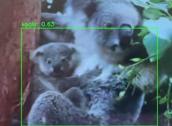

# Real-Time Koala Detection System

Computer vision project using **PyTorch**, **OpenCV**, and **transfer learning** to classify koalas in images and run real-time inference on webcam or video input.

## Project Overview

This project builds a wildlife monitoring pipeline that:

- trains a binary image classifier (**koala / not_koala**)
- applies image preprocessing and augmentation
- performs real-time inference using OpenCV
- overlays live predictions on webcam or video frames

## Technologies Used

- Python
- PyTorch
- Torchvision
- OpenCV
- NumPy
- Scikit-learn


## Project Structure
```text
koala-detection-system/
├── README.md
├── requirements.txt
├── src/
│   ├── dataset.py
│   ├── model.py
│   ├── train.py
│   └── inference.py
└── examples/
    └── sample_frame.jpg
```

Local dataset format:
## Dataset Structure

```text
data/
├── train/
│   ├── koala/
│   └── not_koala/
├── val/
│   ├── koala/
│   └── not_koala/
└── test/
    ├── koala/
    └── not_koala/
```

## Installation
```text
pip install -r requirements.txt
```

## Training
```text
cd src
python train.py --data_dir ../data --epochs 8 --batch_size 32
```

## Real - Time Inference
using Webcam:
```text
cd src
python inference.py --model_path ../models/best_model.pt --source 0
```

using Video File:
```text
cd src
python inference.py --model_path ../models/best_model.pt --source ../examples/koala_video.mp4
```

##Notes
This repository is intended for educational and portfolio purposes.
Dataset images are not stored in the repository.
Add data/, models/, and outputs/ locally when running the project.

## Example Output




